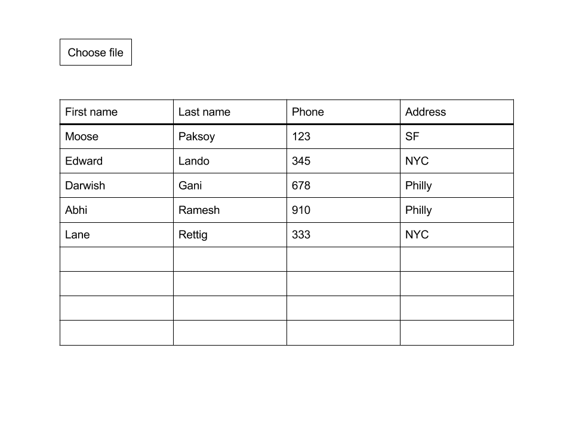
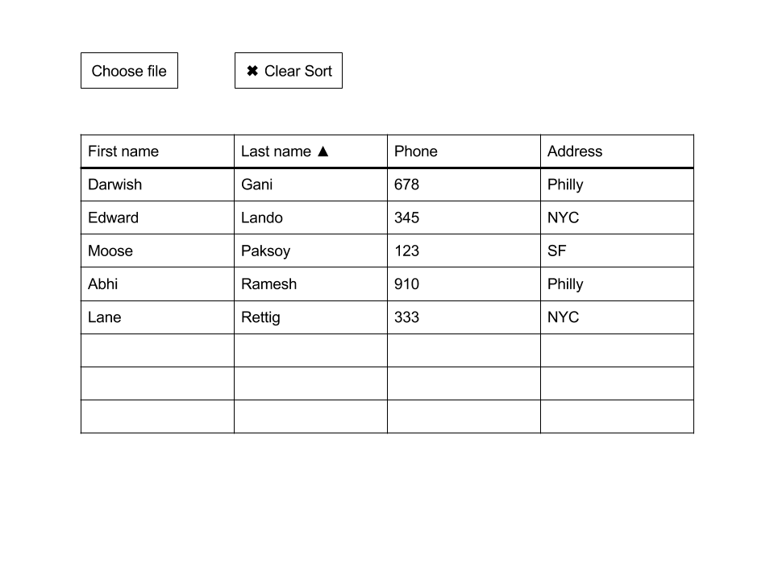
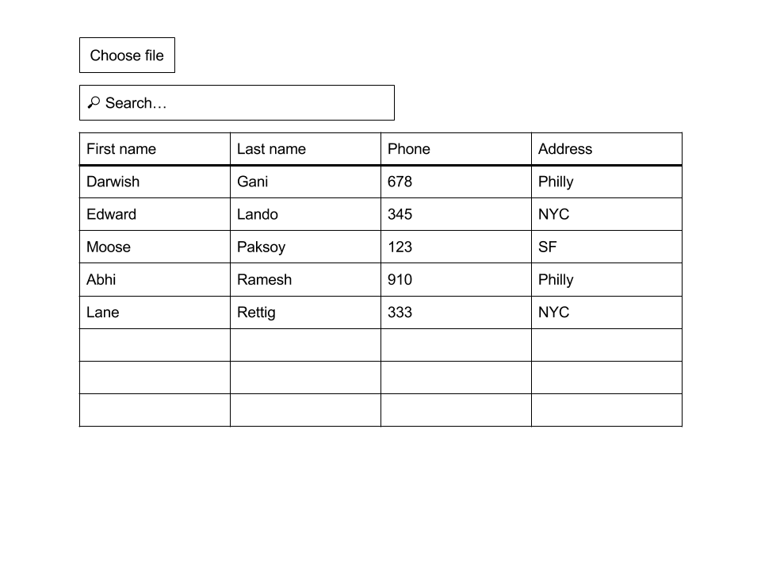
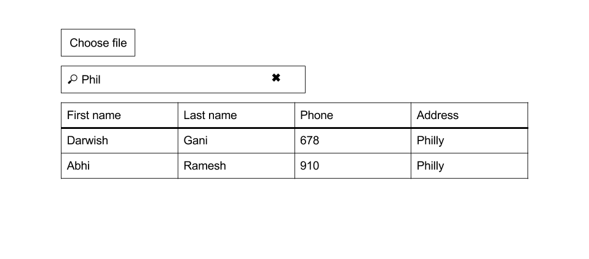

# Pair programming exercise: Reactive table

## Goal

The goal of this exercise is to display tabular data interactively using React.

### Sample output

#### CSV data

```csv
First name,Last name,Phone,Address
Moose,Paksoy,123,SF
Edward,Lando,345,NYC
Darwish,Gani,678,Philly
Abhi,Ramesh,910,Philly
Lane,Rettig,333,NYC
```

#### Page layout



#### Page layout (sorted)



#### Page layout (Search)

With no query:



With query:



### User interaction flow

1. User clicks the file picker and chooses a CSV file
1. (Optional) If the provided file is not a CSV file, page displays error.
1. Page reads the contents of the file via JavaScript and parses it using the
   `csv-parse` npm package
1. Page displays and HTML table representing the contents of the CSV file.
   Use the first line of the file as column headings
1. User clicks column heading to sort table by contents of that column
1. User clicks the column heading again to reverse the direction of the
   sort
1. User clicks "Clear Sort" button to revert the data to it's original format
1. User types in the "Search" box, which filters down table contents
   using simple string matching with `string.indexOf(query) > -1`


## Instructions

For this exercise you will have a single React component that renders the
whole page. Tomorrow we're going to learn how to split React applications
into components that talk to each other. We don't need that today.

### Step 0: Running your app - `http://localhost:3000`

Start your app with `npm start` and visit
[localhost:3000](http://localhost:3000/) to view it - don't forget to `npm install` 
your dependencies first!

Your app comes preconfigured `webpack` hot module reloader - this means that when you make changes to the file, the file will be automatically reloaded. No nodemon needed.

Your React code goes in `reactive-table/client/index.js` and your
HTML code goes in `index.html`.

Bootstrap has been included for you. You can add more CSS files in
`reactive-table/css`.

**Tip:** Using Chrome? For React-specific debugging tools, download [this extension](https://chrome.google.com/webstore/detail/react-developer-tools/fmkadmapgofadopljbjfkapdkoienihi) for 
the ability to inspect `state` and other properties at any point in time for each of your components. Make sure 
to restart Chrome after you have installed the extension.

### Step 1: Read file data in JavaScript - `client/index.js`

Use the provided `FileInput` component in `client/file-input.js` to display a file picker on the page.
This component has an `onChange` event handler that is called with the contents
of the file after it has been read. Add contents to the `onChange` function that logs the contents of any file
that the user selects.

```jsx

onChange: function(val) {
    console.log(val);
},

[...]

<FileInput className="form-control" onChange={this.onChange} />
```

### Step 2: Parse CSV file data - `client/index.js`

> **Note:** We have already included `csv-parse` in `package.json` for you! If you `npm install`'d, you 
should be able to `require('csv-parse'` and get started!

1. Use the `csv-parse` library to parse the data from the user specified file
   into JavaScript arrays.

  ```javascript
  var parse = require('csv-parse');
  parse(data, {}, function(err, data) {
    if (err) {
      console.log('error parsing', err);
    } else {
	// Do something with the received data!
    }
  });
  ```
  
Try logging the parsed CSV data returned to you in the callback function as `data` and think about 
how you might want to iterate over this `data` to render individual table rows and columns.

### Step 3: Display data in a table - `client/index.js`

1. Modify the `render` function of the `<App />` component to create a table with all elements in the array. Use a JSX `<table>` to display your data.
1. Modify the `getInitialState` function of the `<App />` component to set the initial state of the data (an array of arrays representing rows and columns, which will be populated in the `onChange` function) - the initial state can simply be an empty array.
1. Modify the  `onChange` function of the `<App />` component to initialize the table data arrays and parse the data from CSV - use `setState` to modify your state and re-render your `<App />`
1. In the `render` method, create an array of 'headers' for each column, using the first line of the CSV file as headers.
	
	**Note:** Use `<th>YOUR HEADING HERE</th>` to render each table header inside of a containing `<thead>` and `<tr>` element! Your columns should be formatted in HTML like the following:
	
	```
	<table>
		<thead>
			<tr>
				<td>Column 1</td>
				<td>Column 2</td>
				<td>Column 3</td>
			</tr>
		</thead>
		[...]
	</table>
	```
	
1. Display the rest of the data in the table body. One way to do this is to map the columns array into an array that contains
all the react elements that will be displayed
	```
		return columns.map(function(c, i) {
		  return <td key={i}>{c}</td>;
		})
	```
	
	<sub>`key` helps you and  React keep track of which elements are which - this leads to better performance, so that only specific elements that are changed are re-rendered. It also lets you keep track of which item you've interacted with, in a very similar way to `event delegation`</sub>
	
	**Note:** Wrap each of your `<td>` columns/cells into `<tr>` rows, all of which should be inside of a `<tbody>`. The resulting HTML should look like the following:
	
	```
	<table>
		[...]
		<tbody>
			<tr>
				<td>Col 1</td>
				<td>Col 2</td>
				<td>Col 3</td>
			</tr>
			[...]
		</tbody>
	</table>
	```
	

1. **Remember that a table is an array of arrays**. You have to map once for rows -> `<tr>` and once again on each row for cells `<td>`

### Step 4: Sort by column

We are going to build a simplified version of sorting, allowing you to sort your table's data in ascending or descending order.

1. Add an `onClick` event listener to the table headers (set this as a property on your `<th>`'s).
1. This should call a function on the component that sorts your table according to a specific column.
1. Clicking the column once should sort in ascending order. Clicking the column header again should toggle between 'asc' and 'dsc' order
1. Add a '▲' or '▼' character to the column header showing how the column is currently sorted. (You can copy and paste those, or use a glyphicon. Up to you.)
1. Sort the data array according to the user's new preferences.

<sub>You can represent your 'sorting filters' as an object that shows which columns (if any) are sorted in either direction.</sub>
```
sortDir: {FirstName: 'asc', LastName: 'dsc'}
```

Note: Keep a copy of the data array somewhere else to restore when resetting your sorting preferences

1. Add a button that restores the initial order.
1. A copy of the original data would be a good way to do this, instead of reading and parsing the CSV again.
1. Clear all the filters if you have any.

<sub>If you represented the sorting filters like this, this is what it would look like after you cleared it.</sub>
```
sortDir: {}
```

### Step 5: Search

1. Create an object, string or array that holds your search queries in your component's state.
1. Create a form with a text input that receives the search query.
1. Add an onChange listener to the form that detects, stores and saves the query string to your component's state using `setState()`
1. Filter the elements that are displayed using indexOf() to check if the element contains the queried value.
HINT: Don't modify the data array, just filter the ones you display on render.

### Bonus step: Search by column

1. Using the same procedure as above, add an input on the headers of each column, below the title.
1. Use a filters array to store the values for each column and their queries.
1. Filter the elements being displayed.

**BONUS**: Instead of only having one column sorted at a time, create an object `sortDir` that
contains both the sorted column name and their directions so you can sort using more than one column at a time. For example:

Your filters array could look like this:
contains both the sorted column name and their directions so you can sort using more than one column at a time. For example:
```
filters: {FirstName: 'Moose', Number: '1'}
```
A good idea would be to use the same filters array for the column data as for step 6.
You can use the name "Global" for the main search bar

### Credits

Boilerplate code courtesy of
[React Hot Boilerplate](https://github.com/gaearon/react-hot-boilerplate)
