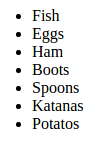
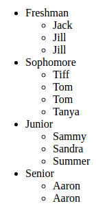

# React Examples

## Lists and Keys

## [Watch Me]()


Use Codepen [here](https://codepen.io/rick-shar/pen/xdeQxQ)
	

1. Display array ```groceries``` as a list just like the picture. Use classes ```GroceryItem``` and ```ShoppingCart``` in a way that makes sense; use the item names as keys.

Use Codepen [here](https://codepen.io/rick-shar/pen/JNVejw)
	


1. Display array ```roster``` as a nested list, as in the picture. Use the provided classes in a way that makes sense - make sure that you use keys for both mappings, and that the keys are unique!


## Forms in React

## [Watch Me]()

Use Codepen [here](https://codepen.io/rick-shar/pen/EmJGvP)
	

1. Create a React Form that enforces validation on the email and password fields. The email must have at least 3 characters before the '@' and the password must have a minimum of 4 characters that contain at least 1 number and at least 1 letter.


## State, Lifecycle Hooks

## [Watch Me]()

Use Codepen [here]()

1. 
