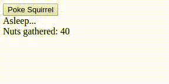

# React Examples

## Lists and Keys

## [Watch Me]()

	
1. Display array ```groceries``` as a list just like the picture. Use classes ```GroceryItem``` and ```ShoppingCart``` in a way that makes sense; use the item names as keys.

	Use Codepen [here](https://codepen.io/rick-shar/pen/xdeQxQ)
	
	

1. Display array ```roster``` as a nested list, as in the picture. Use the provided classes in a way that makes sense - make sure that you use keys for both mappings, and that the keys are unique!

	Use Codepen [here](https://codepen.io/rick-shar/pen/JNVejw)
	
	


## Forms in React

## [Watch Me]()

Use Codepen [here](https://codepen.io/rick-shar/pen/EmJGvP)


1. Create a React Form that enforces validation on the email and password fields. The email must have at least 3 characters before the '@' and the password must have a minimum of 4 characters that contain at least 1 number and at least 1 letter.


## State, Lifecycle Hooks

## [Watch Me]()
<details>
<summary>Should like this (Warning: Cuteness overload) </summary>

  

</details>

1. In the Codepen below utilize the correct lifecycle hook and ajax to grab data (using ajax GET) from URL: https://api.myjson.com/bins/rztih . 

	Use Codepen [here](https://codepen.io/rick-shar/pen/BRezxW)
  

1. A local Squirrel sleeps or wakes up whenever it is poked. While it is awake, it collects nuts to survive. You are given a function, ```gather```, as a prop. Using only lifecycle functions and a timer, make it so that the Squirrel component only "gathers" nuts while it is awake (the Squirrel component is mounted when woken and unmounted when asleep).

	Use Codepen [here](https://codepen.io/josephch405/pen/qmwQmG?editors=1010)

	
