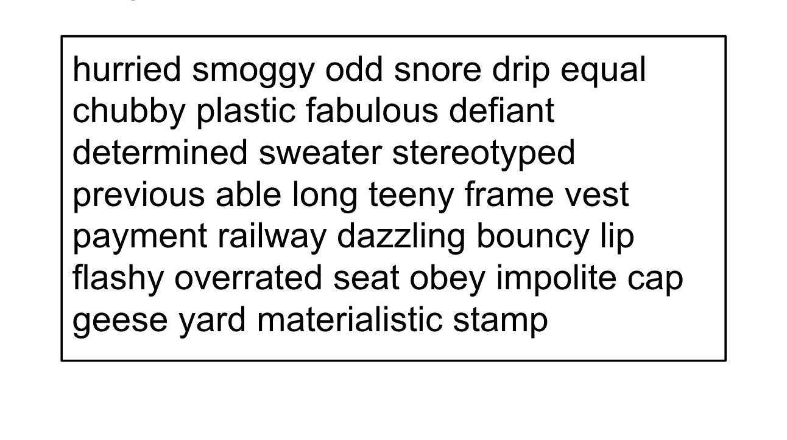
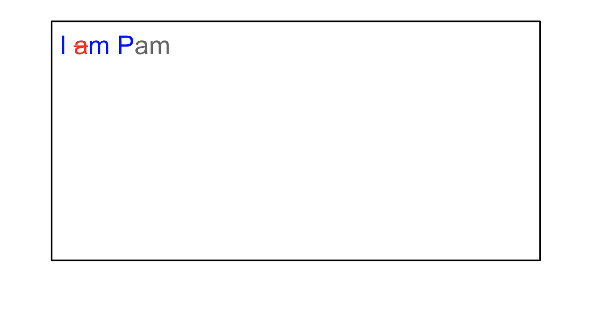
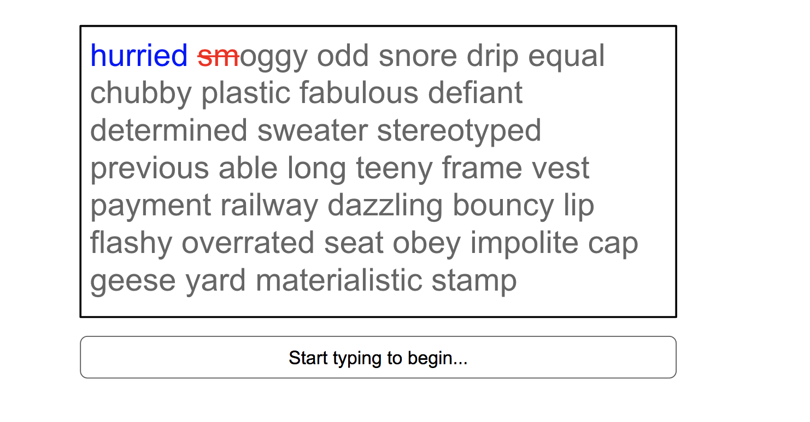
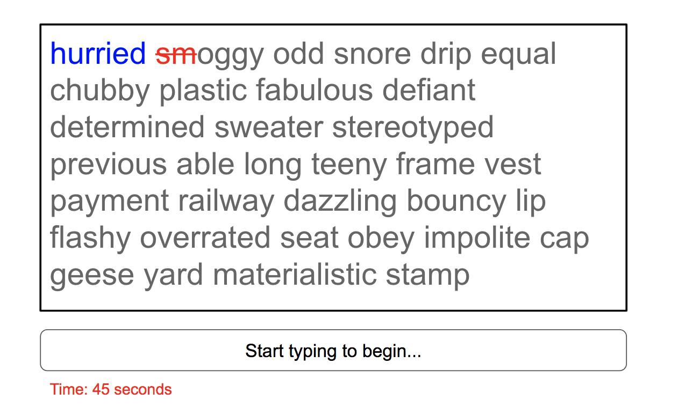
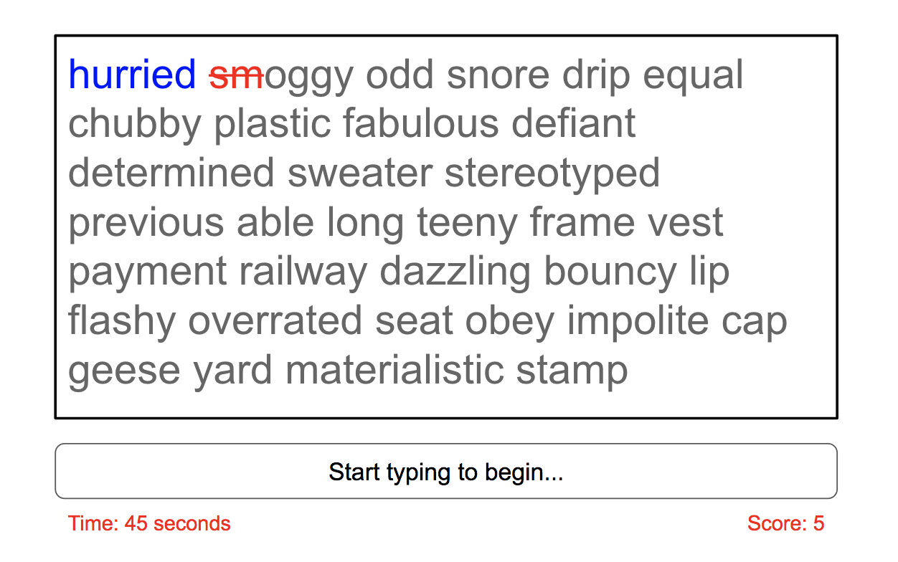
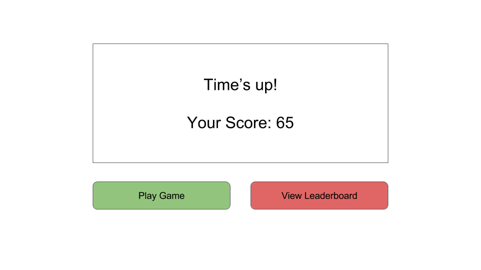
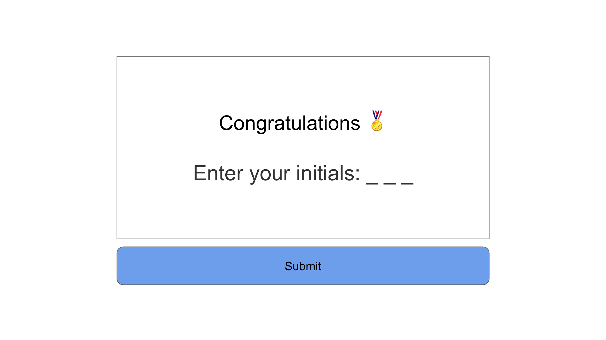
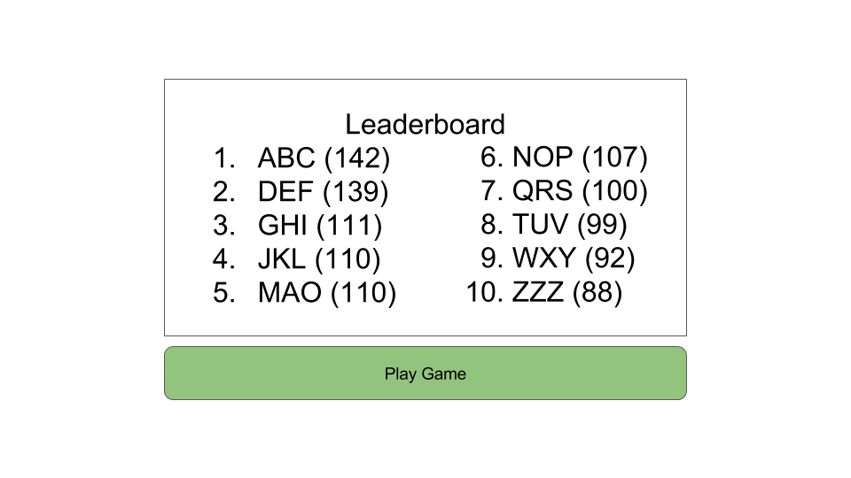

# React/Redux Typing Game
The goal of this exercise is to write a typing game using React/Redux. Feel free to ignore all of these instructions and use the screenshots to guide your way. This folder is a React/Redux template similar to the one you worked on for yesterday's exercises, so you should be familiar with its' structure.

## Part 1: Setup & Start Game

Currently if the user navigates to `index.html` the `app/components/App.js` component is displayed. For Part 1 you will write code to set-up the game and to start the gameplay.


1. Create a new reducer to keep track of your game state in `reducers/gameReducer.js` and add it to `reducers/index.js`
    1. Import words from `app/dictionary.js`
    1. Use [`_.shuffle`](http://underscorejs.org/#shuffle) from the Underscore.js library to randomize the loaded words
    1. Get the first **100 words** from this list and add them to your initial state under `wordList`
1. Edit `containers/GameContainer.js`
    1. Update `mapStateToProps()` and map `wordList` to your props
1. Create a `WordBox` component and add it to `GameContainer`, it will receive `wordList` via props. Your WordBox component is responsible for rendering a div containing each word in its `wordList`prop.
    1. [Sample CSS/HTML for your `WordBox` component](https://codepen.io/horizons/pen/QgVmmm?editors=1100)
    1. Put each character inside of its own `<span>` so that characters can be differentiated from each other later on
        
        *Hint* Use a nested map such that the outer map will map every word into a div, and the inner map will map each individual character of every word into a span.
    1. Put your CSS in `app/index.tpl.html` where it says `YOUR CSS STYLES HERE`


### Goal

When the user first navigates you should now see something similar to the following image.




## Part 2: Highlight Letters & Mistakes
In order to implement character highlighting functionality, we would like to store information about each character within our state. In your state, lets have our `wordList` be an array of arrays. The inner arrays correspond to a word and contain character/letter objects representing a letter in that given word. For example,
at the beginning of the game, the words `['I', 'am', 'Pam']` would be represented
as:

```JavaScript
{
    wordList: [
        [{letter: 'I', status: 'pending'}],
        [
            {letter: 'a', status: 'pending'},
            {letter: 'm', status: 'pending'}
        ],
        [
            {letter: 'P', status: 'pending'},
            {letter: 'a', status: 'pending'},
            {letter: 'm', status: 'pending'}
        ]
    ]
}
```

Each character/letter corresponds to a character object with the properties:

- `letter`: This will hold the letter value that should be displayed
- `status`:  This will be either `pending`, `correct`, `incorrect`. Characters in the 'pending' state are those that have not been typed yet and will be displayed in gray. Characters in the 'correct' or 'incorrect' state will be the characters the player has correctly/incorrectly typed and should be highlighted in blue and red respectively.

<!-- ### Typing - TextBox Component -->
Update the way our `WordBox` component is rendered:
- Now that each character in our `wordList` prop is represented by an object `{letter: 'a', status: 'pending'}`, we must style each character span our `WordBox` renders to be the color corresponding to its `status`

### Goal

Make sure characters appear in the correct color by changing the characters' initial `status` to `correct` or `incorrect`. Correct letters should be highlighted blue
and incorrect letters should be highlighted red.



## Part 3: Typing

1. Create a `TextBox` component for user input
1. Update `GameContainer` and pass `this.onInput()` to `TextBox` as a prop, call this function in `TextBox` when user types
    - Using the `onChange` property for the `<input>` element in the `TextBox` component we will implement character highlight functionality. We will implement this functionality by adding an array (called `userInput`) for inputted words to our state, and comparing it against our `wordList`.
1. Add the following to our state:
    - `currentIndex` (initially `[0,0]`): an array of 2 numbers that point to our current location in the array in the format `[word #, char #]` - remember that since strings are Arrays in JavaScript we can use Array notation to access characters.
1. Dispatch the following actions from `GameContainer`'s `onInput()` function:
    1. __IF__ a new non-whitespace character is entered, compare the user's input against our `wordList` at the `currentIndex` and dispatch a `CHAR_ADDED` action w/the new word and a boolean as the payload.
        - <details>
            <summary>Hint</summary>
            <div>

            ```javascript
            dispatch({type: 'CHAR_ADDED', word: [user input], isCorrect: [true or false]});
            ```

            </div>
            </details>
        - You should add/replace the word at `userInput[word#]` with the new word. Remember, our word number is the value stored at index 0 of our `currentIndex` array. (word# = `currentIndex[0]`)
        - Update the character's `status` from `pending`  to either `correct` or `incorrect` depending on `action.isCorrect`
    1. __IF__ a whitespace character is entered dispatch a `NEXT_WORD` action
        - clear the `<input>` element in your `TextBox` component
        - increment `currentIndex` accordingly. We want to increment the `word #` index and set the `char #` index back to zero.
            
            <details>
            <summary>Hint</summary>
            <div>
            Add 1 to `currentIndex[0]` and set `currentIndex[1]` back to zero.
            </div>
            </details>


__Note:__ The user __SHOULD NOT__ be able to press the DELETE/BACKSPACE key to undo mistakes in this game

[Sample HTML/CSS for `WordBox` and `TextBox`](https://codepen.io/horizons/pen/Pjdepe?editors=1100)


### Goal

When you start typing, you should see letters correctly typed letters highlighted in blue and incorrectly typed letters highlighted in red.




### Part 4: Timing

Let's add timing functionality to this game. We need to add a timer that will begin counting once the user starts typing, and will stop once the game has ended (once the user has typed all words in the box).
-reducer when char added action is triggered should update cahr status, update index, update score
1. Create a `InfoBar` component to display the timer. Add `currentTime` to your initial state in your reducer and give it the initial value `-1`, Have `InfoBar` receive a prop `currentTime` and display it bellow the `TextBox`. If the `currentTime` is -1, lets just display a `-` in place of the number of seconds to indicate the game has yet to start.
1. Update `mapDispatchToProps()` and create three actions `START_GAME`, `INCREMENT_TIMER`, and `END_GAME`.
1. Update the `onInput()` function in `GameContainer` with:
    1. Dispatch a `START_GAME` action when the game beings.
    We can tell when a user has first began typing by checking our `currentIndex` prop in our `GameContainer`. We already have a function `onInput(input)` that will get called for every typing event in our TextBox, so all we need to do is check to see if our  `currentIndex` is `[0,0]` and then we will know that this is the first call to `onInput` and so our game has begun.
    1. Use `setInterval` inside `onInput()` to dispatch an `INCREMENT_TIMER` action every 1000ms. Additionally, the `setInterval` should dispatch an `END_GAME` action once all the words have been typed.
    1. Save the id that `setInterval()` returns under variable `interval` so you
        can clear it later when the game ends
        (i.e. the timer has run out).

        <details>
        <summary>Hint</summary>
    
        ```javascript
        let interval = setInterval(() => {
            //dispatch INCREMENT_TIMER action
            if (user has completed typing all the words) {
                //dispatch END_GAME action
                clearInterval(interval);
            }
        }, 1000);
        ```
        </details>

## Goal

When you start typing, you should see the timer change for every second passed.



## Part 5: Scoring
1. Update `InfoBar` component to display the total score (initially 0)
1. Add the following to our state:
    - `totalScore`: # of matching letters - # of mismatching letters
1. Calculate `totalScore`. We already  compare `wordList` and `input` in our `onInput` function in our `GameContainer`.  We are going to want to dispatch an action(s) to either increment or decrement `totalScore` in our state.  We will leave it to you to decide the necessary actions to make these changes.
1. When the game is over, you should either alert the user or display a message saying





## Part 6: Game Over

When the `setInterval` dispatches an `END_GAME` action end the game and display a Game over page. `Game over! Final Time: [time in seconds] Score: [total score]`

<!-- 1. When `END_GAME` is dispatched update `totalScore` by adding `streakCount` and `totalScore` -->
1. Create a `GameOver` container which contains `FinalScore`, `PlayGameButton`, and `ViewLeaderboardButton` components
1. Create a route for this page of your App
1. Display `totalScore` and `currentTime` in the `FinalScore` component
1. Clicking the `PlayGameButton` should dispatch a `RESTART_GAME` action, which resets the values in state (i.e. set `currentIndex` to `[0,0]`, `totalScore` to `0`, etc...) and navigates you back to the default route where you should see the `GameContainer`
1. Clicking the `ViewLeaderboardButton` navigates you to the route you create in the next part for the Leaderboard

### Goal
Your finished __Game Over!__ page should look something like the following.



## BONUS: Part 7: Leaderboard
If your `totalScore` was in the Top 10, the `END_GAME` action asks you for your 3-character initials and adds you to the Leaderboard. __Note__ you can use `localStorage` to keep track of top 10 user scores (by putting them in an Object like below). Since `localStorage` only works with Strings, you will have to use `JSON.parse` and `JSON.stringify` to store Objects.

```js
{
  "1": {
    "name": "ABC",
    "score": 102
  },
  "2": {
    "name": "DEF",
    "score": 101
  }
}
```

1. When `END_GAME` is dispatched, check if the user's `totalScore` is in the Top 10
1. If __NOT__ in the Top 10 follow instructions in the last Part
1. If user is in the Top 10, point them to a `RegisterContainer` (this contains `InitialsInput` and `SubmitButton` components)
1. When the `SubmitButton` is pressed, add the initials & `totalScore` to localStorage (while also removing the tenth place user if one exists). Then navigate the user to the Leaderboard route
    
1. Create a `Leaderboard` container which has a `Board` component and a `PlayGameButton` component, and also create a corresponding route for the Leaderboard
1. The `Board` component retrieves the Top 10 scores from `localStorage` and displays them - rtrieve in comonent did mount from local storage into state,
1. The `PlayGameButton` fires a `RESTART_GAME` action (whose behavior was described in an earlier part)

### Goal
Your completed leaderboard should look a little something like the following image.




## BONUS: Part 8: Streaks
1. Update `InfoBar` the current streak bonus (all initially 0)
1. Add the following to our state:
    - `streakCount`: the current streak bonus
1. When `END_GAME` is dispatched update `totalScore` by adding `streakCount` and `totalScore`.
1. Modify `RESTART_GAME` action, which now must also reset the `streakCount` in state to 0
1. Change how we calculate `totalScore`. `totalScore`: (# of matching letters + streaks) - # of mismatching letters
1. Calculate `streakCount`.
The streak is the total number of words the player gets correct in a row (1 word = 1 point ; 2 words = 1 + 2 points ; 3 words = 1 + 2 + 3 points...). These points are awarded as bonus _on top of_ the points received for character matching. So for instance if a user correctly matched the words `"horizons is amazing"` they would get a total of `(8+1) + (2+2) + (7+3) = 23` points. The following is an example of a streak. __Note__ that a streak is not added to the total score until a mistake has been made to reset the streak or the game has ended.


## Done!

Congratulations! You've finished the React/Redux typing game. Here are a few bonus features you can implement to make it extra special.

- Keep track of speed (words/min) and create a graph of typing speed over time
- Multiplayer Mode
    - The same set of words are given to each player & the player w/the highest points wins
    - Sudden Death: First player to make a mistake loses
