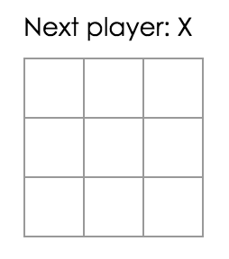

# Make Tic Tac Toe

Today we will be making a Tic Tac Toe game in React - the "Hello World" equivalent for real programmers (saying "Hello world!" just isn't impressive enough anymore). By the end of this exercise you will have:
1. A clickable grid where our master strategists can place Xs and Os
1. A status text reflecting the state of the Game
1. A history panel that allows for time travel

Here are the part of the exercise:
1. Install React Development Tools
1. The Square Component
1. etc

## Part 1: Install React Development Tools
Install the React Developer Tools extension [here](https://chrome.google.com/webstore/detail/react-developer-tools/fmkadmapgofadopljbjfkapdkoienihi).

This extension allows you to inspect React components, states, props etc, as your app is running. Use this often to make sure your components are behaving correctly!

We will be using [this codepen](https://codepen.io/josephch405/pen/RVdPQw) for this exercise.

## Part 2: The Square Component
### Goal
We want to design a React component representing a "grid" in our game, capable of displaying Xs and Os and responding to events.

### Steps
1. From the Board component, change ```renderSquare``` so that we pass a value to the Square:
```javascript
class Board extends React.Component {
  renderSquare(i) {
    return <Square value={i} />;
  }
  ...
}
```

1. Change the Square component so that the Square displays the passed-down prop:
```javascript
class Square extends React.Component {
  render() {
    return (
      <button className="square">
        {this.props.value}
      </button>
    );
  }
}
```

At this point, your app should look like this:



1. Change the button so that when clicked, it'll display an alert saying "1337". Remember that for React components, the "onclick" property is actually "onClick", camel-case. Clicking the squares now should trigger a popup.

## Part 3: Lifting State Up
## Part 4: Immutability
## Part 5: Functional Components
## Part 6: Taking Turns
## Part 7: Winner Calculation
## Part 8: Display Game Status

## Part 9: Moves
## Part 10: Keys
## Part 11: Time Travel
