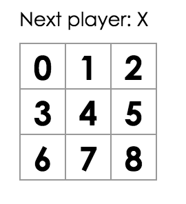

# Make Tic Tac Toe

Today we will be making a Tic Tac Toe game in React - the "Hello World" equivalent for real programmers (saying "Hello world!" just isn't impressive enough anymore). By the end of this exercise you will have:
1. A clickable grid where our master strategists can place Xs and Os
1. A status text reflecting the state of the Game
1. A history panel that allows for time travel

Here are the part of the exercise:
1. Install React Development Tools
1. The Square Component
1. etc

## Part 1: Install React Development Tools
Install the React Developer Tools extension [here](https://chrome.google.com/webstore/detail/react-developer-tools/fmkadmapgofadopljbjfkapdkoienihi).

This extension allows you to inspect React components, states, props etc, as your app is running. Use this often to make sure your components are behaving correctly!

We will be using [this codepen](https://codepen.io/josephch405/pen/RVdPQw) for this exercise.

## Part 2: The Square Component
### Goal
We want to design a React component representing a "grid" in our game, capable of displaying Xs and Os and responding to events.
### Steps
1. From the Board component, change ```renderSquare``` so that we pass a value to the Square:
  ```javascript
  class Board extends React.Component {
    renderSquare(i) {
      return <Square value={i} />;
    }
    ...
  }
  ```
1. Change the Square component so that the Square displays the passed-down prop:
  ```javascript
  class Square extends React.Component {
    render() {
      return (
        <button className="square">
          {this.props.value}
        </button>
      );
    }
  }
  ```
  At this point, your app should look like this:

  
1. Change the button so that when clicked, it'll display an alert saying "1337". Remember that for React components, the "onclick" property is actually "onClick", camel-case. Clicking the squares now should trigger a popup.
1. Since Square only uses the ```render``` method, we can turn it into a **functional component**. The general structure of a functional component looks like this, as an example:
  ```javascript
  function ComponentName(props){
    return(
      <div>
        //stuff here
      </div>
    );
  }
  ```

## Part 3: Lifting State Up
## Part 4: Taking Turns
### Goal
Now we have a game where player x (but not y) can place pieces (and thus always win). We'll have to nerf this - we want the players to take turns.

### Steps
1. Make a new boolean in the Board's state object called ```xIsNext``` - initialize it to ```true``` so that player x plays first.
  ```javascript
    class Board extends React.Component {
      constructor() {
        ...
        this.state = {
          ...
          xIsNext: true,
        };
      }
    }
  ```
1. Change the board component's ```handleClick``` so that
  1. The ```squares``` array is updated with the correct player piece
  1. xIsNext as a state variable is updated
```javascript
  handleClick(i){
    ...
    squares[i] = this.state.xIsNext ? 'X' : 'O';
    this.setState({
      ...
      xIsNext: !this.state.xIsNext,
    });
  }
```
1. Change the board component's ```render``` method so that the status updates correctly - ie it says "Next player: X" or "Next player: O"
```javascript
const status = 'Next player: ' + (this.state.xIsNext ? 'X' : 'O');
```

At this point, you should be able to play through the game as expected - but without a proper endgame. Let's fix that.

<<<<<<< Updated upstream
## Part 5: Winner Calculation
### Goal
We want the game to stop when one of the players has made a line - one can have too much winning, after all. We want the status text to represent this state.

### Steps
1. Add ```calculateWinner``` to the end of your code - this is a help function that takes in an array representing a board and outputs a winner (x, o) or ```null``` if nobody has won yet.
  ```javascript
  function calculateWinner(squares) {
    const lines = [
      [0, 1, 2],
      [3, 4, 5],
      [6, 7, 8],
      [0, 3, 6],
      [1, 4, 7],
      [2, 5, 8],
      [0, 4, 8],
      [2, 4, 6],
    ];
    for (let i = 0; i < lines.length; i++) {
      const [a, b, c] = lines[i];
      if (squares[a] && squares[a] === squares[b] && squares[a] === squares[c]) {
        return squares[a];
      }
    }
    return null;
  }
  ```
1. Update the ```render``` code in Board so that we first use ```calculateWinner``` to check if someone has won, then update the status accordingly.
  ```javascript
  render() {
    const winner = calculateWinner(this.state.squares);
    let status;
    if (winner) {
      status = 'Winner: ' + winner;
    } else {
      status = 'Next player: ' + (this.state.xIsNext ? 'X' : 'O');
    }
  }
  ```
1. Update the ```handleClick``` method so that if either someone has won *or* the target location is already occupied, then the method would return immediately and change nothing on the board.
```javascript
handleClick(i) {
    const squares = this.state.squares.slice();
    if (calculateWinner(squares) || squares[i]) {
      return;
    }
    squares[i] = this.state.xIsNext ? 'X' : 'O';
    this.setState({
      squares: squares,
      xIsNext: !this.state.xIsNext,
    });
  }
```

## Part 6: Storing and Showing History
### Goal
We want to implement a history feature, where we can revisit the board across different points in time. This means that we need to **store**, **show** and **restore** game states. Let's store history in an array like so:
```javascript
history = [
  {
    squares: [
      null, null, null,
      null, null, null,
      null, null, null,
    ]
  },
  {
    squares: [
      null, null, null,
      null, 'X', null,
      null, null, null,
    ]
  },
  // ...
]
```

## Part 7: Moves
## Part 8: Keys
## Part 9: Time Travel
=======
## Part 3: Lifting State Up
### Goal

To make a fully-working game, we now need to check if one player has won the game, and alternate placing X and O in the squares. To check if someone has won, we'll need to have the value of all 9 squares in one place, rather than split up across the Square components.

The best solution here is to store this state in the Board component instead of in each Square – and the Board component can tell each Square what to display, like how we made each square display its index earlier.

**When you want to aggregate data from multiple children or to have two child components communicate with each other, move the state upwards so that it lives in the parent component. The parent can then pass the state back down to the children via props, so that the child components are always in sync with each other and with the parent.**

### Steps

1. Pulling state upwards like this is common when refactoring React components, so let's take this opportunity to try it out. Add a constructor to the Board and set its initial state to contain an array with 9 nulls, corresponding to the 9 squares:

  ```javascript
  class Board extends React.Component {
    constructor() {
      super();
      this.state = {
        squares: Array(9).fill(null),
      };
    }
  ...
  }
  ```

  We'll fill it in later so that a board looks something like

  ```
  [
    'O', null, 'X',
    'X', 'X', 'O',
    'O', null, null,
  ]
  ```

1. Modify Board's ```renderSquare``` method to look like this:

  ```javascript
  renderSquare(i) {
    return <Square value={this.state.squares[i]} />;
  }
  ```

1. Now we need to change what happens when a square is clicked. The Board component now stores which squares are filled, which means we need some way for Square to update the state of Board. Since component state is considered private, we can't update Board's state directly from Square.

  The usual pattern here is pass down a function from Board to Square that gets called when the square is clicked. Change renderSquare in Board again so that it reads:

  ```javascript
  renderSquare(i) {
    return (
      <Square
        value={this.state.squares[i]}
        onClick={() => this.handleClick(i)}
      />
    );
  }
  ```

  We split the returned element into multiple lines for readability, and added parens around it so that JavaScript doesn't insert a semicolon after return and break our code.

  Now we're passing down two props from Board to Square: value and onClick. The latter is a function that Square can call. Let's make the following changes to Square:

  * Replace ```this.state.value``` with ```this.props.value``` in Square's ```render```.
  * Replace ```this.setState()``` with ```this.props.onClick()``` in Square's ```render```.
  * Delete ```constructor``` definition from Square because it doesn't have state anymore.

  After these changes, the whole Square component looks like this:

  ```javascript
  class Square extends React.Component {
    render() {
      return (
        <button className="square" onClick={() => this.props.onClick()}>
          {this.props.value}
        </button>
      );
    }
  }
  ```

  Now when the square is clicked, it calls the onClick function that was passed by Board.

1. Try clicking a square – you should get an error because we haven't defined handleClick yet. Add it to the Board class.

  ```javascript
  class Board extends React.Component {
    ...
    handleClick(i) {
      const squares = this.state.squares.slice();
      squares[i] = 'X';
      this.setState({squares: squares});
    }
    ...
  }
  ```
  We call ```.slice()``` to copy the ```squares``` array instead of mutating the existing array. This is done to maintain **Immutability** which we will cover in a later video.

  Now you should be able to click in squares to fill them again, but the state is stored in the Board component instead of in each Square.

  Square no longer keeps its own state; it receives its value from its parent Board and informs its parent when it's clicked. We call components like this **controlled components**.


## Part 5: Functional Components
## Part 6: Taking Turns
## Part 7: Winner Calculation
## Part 8: Display Game Status

## Part 9: Moves
## Part 10: Keys
## Part 11: Time Travel
>>>>>>> Stashed changes
